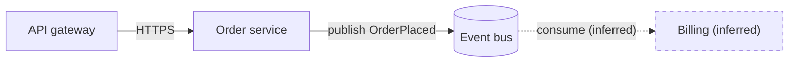

# Modeling And Layout

Use this reference after the diagram's question and evidence boundary are known.

## Table of Contents

- Evidence Model
- Model Router: architecture, deployment, workflow, sequence, data flow, lifecycle, comparison
- Choosing The Medium
- Layout Decisions

## Evidence Model

- Assign stable IDs from domain meaning, not display order or coordinates. A later
  layout move must not look like a new component.
- Record the evidence that supports each node and relationship while authoring. For
  repository evidence, prefer an exact revision plus repo-relative file and line when
  the line is stable enough to cite. For runtime evidence, record the environment and
  observation time. Do not embed private source locations in an artifact whose
  audience should not receive them.
- A node proves existence only at the scope of its evidence. A class or manifest can
  prove declared structure; it does not prove deployment, traffic, health, ownership,
  or usage. Show those only from matching evidence.
- Every arrow asserts at least direction and relationship. Label protocol, action,
  asynchronous behavior, trust crossing, or fallback when an endpoint pair alone
  cannot recover that meaning.
- The default encoding, as it looks in a Mermaid source; carry the same three
  categories and the same evidence notes into any other medium:

  The adjacent note then lists what was left undrawn, such as
  `unknown: whether billing retries a failed OrderPlaced`, and the legend states that
  dashed means inferred.

## Model Router

### Architecture

Show components, stores, external systems, deployment or trust boundaries, and the
few relationships needed to answer the question. Keep logical ownership, physical
placement, and observed runtime state visually distinct instead of mixing them into
one unlabeled container hierarchy.

### Deployment

Show where components run: hosts or clusters, regions, environments, network zones,
and replica counts. Declared placement (manifests, Terraform, Helm values) and
observed placement (what the runtime reports) are different evidence; label which one
each element comes from and never let a manifest stand in for a running instance.

### Workflow

Show the start condition, ordered actions, decision gates, responsible lane when
known, exceptions, rollback or recovery, and terminal outcomes. Do not connect steps
merely because they appear next to each other in a checklist.

### Sequence

Order participants by the main interaction. Preserve calls, returns, asynchronous
handoffs, retries, timeouts, and alternatives that change the request's meaning.
Chronology is the model; spatial proximity must not imply a call that was not authored.

### Data Flow

Show sources, transformations, stores, sinks, and boundary crossings. Label data kind,
sensitivity, batching or streaming, and retention only when evidence supplies them.
Do not present a control call as data movement or infer lineage from shared field names.

### Lifecycle

Show initial, active, waiting, failed, recoverable, cancelled, and terminal states that
actually exist, then label the event or condition for every transition. A retry is a
real transition back to an active state, not a decorative loop around a failure node.

### Comparison

Normalize both snapshots to the same question, boundary, level of detail, and stable
IDs before comparing them. Separate changed facts from layout movement. Describe
added, removed, changed, moved, and rerouted elements literally; assess consequences
from code or operational evidence outside the visual diff.

## Choosing The Medium

The medium is a reading decision, not a house format. Pick the one the reader gets the
relationship from fastest where the diagram will be read, then keep an editable source
that regenerates it.

- Markdown on a code host: Mermaid or the project's diagram format, kept beside the
  content so a later change edits the text.
- HTML page: SVG, or boxes and lines drawn natively with HTML/CSS or canvas when
  that composes better with the page, such as detail cards the diagram links to. Keep
  labels as real text so they can be searched, selected, and read aloud; a canvas
  drawing needs the same facts in text beside it.
- Slide: native shapes in the deck tool, so the diagram stays editable and themed.
- Change over time: a short animation (GIF or video) or an animated page, when the
  movement itself is the point, such as traffic shifting phase by phase or a message
  exchange. Keep every element in a fixed position across frames so only the change
  moves, keep the loop short enough to watch twice, and ship a static frame or step
  list with the same facts.
- A raster screenshot of a diagram is a last resort: it cannot be edited, searched,
  or re-themed, so keep the source that produced it next to it.

## Layout Decisions

- Start with one primary path and place secondary branches beside their attachment
  point. If no path is primary, group peers on one explicit logic such as ownership,
  trust boundary, phase, or layer.
- Use automatic layout for a small graph whose coordinates carry no meaning. Use
  authored geometry when elements must retain position across states, multiple states
  coexist in one frame, boundaries nest, or several connection classes must remain
  visually distinct.
- Route edges around unrelated nodes and labels. Avoid shared corridors that make two
  relationships indistinguishable. Endpoint sides and arrowheads must agree with the
  authored direction.
- Use color only for a semantic category or focus and pair it with text, shape, or
  pattern. Keep the meaning complete in a static, reduced-motion view.
- Move supporting inventories and long evidence into adjacent detail cards or a named
  detail layer. Do not shrink the primary graph until labels become unreadable merely
  to keep every fact on one screen.
